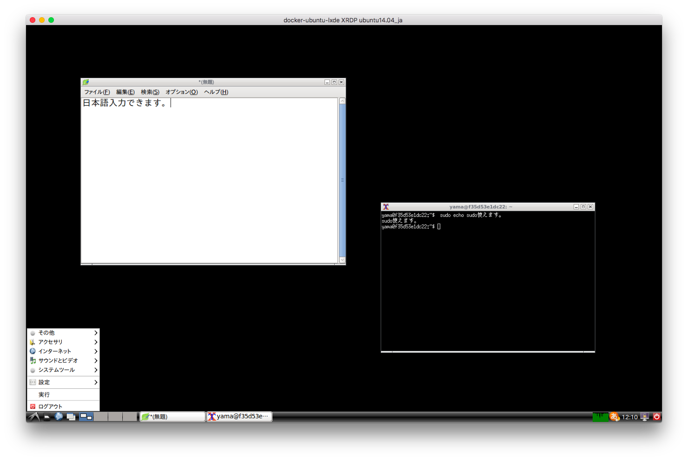

# docker-ubuntu-lxde XRDP

DockerによるUbuntuのLXDEデスクトップ環境です。
リモートデスクトップとしてRDP(xrdp)を使用します。

日本語環境(ibus-mozcによる日本語入力可能)かつ、`-u`による一般ユーザ起動においても`sudo`コマンドが使用可能です。



## docker build

Dockerイメージのビルド方法は以下の通りです。
（イメージの名前やタグは適宜変更してください。）

### Ubuntu14.04ベース
```
$ git clone https://github.com/yama07/docker-ubuntu-lxde.git
$ docker build \
    -t lxde_xrdp:ubuntu14.04_ja \
    -f ./xrdp/Dockerfile.ubuntu14.04 \
    ./xrdp
```

### Ubuntu16.04ベース
```
$ git clone https://github.com/yama07/docker-ubuntu-lxde.git
$ docker build \
    -t lxde_xrdp:ubuntu16.04_ja \
    -f ./xrdp/Dockerfile.ubuntu16.04 \
    ./xrdp
```

### Ubuntu16.10ベース
```
$ git clone https://github.com/yama07/docker-ubuntu-lxde.git
$ docker build \
    -t lxde_xrdp:ubuntu16.10_ja \
    -f ./xrdp/Dockerfile.ubuntu16.10 \
    ./xrdp
```

## docker run

Dockerコンテナの起動方法は以下の通りです。

```
$ docker run --rm -it \
    --privileged \
    -p 3389:3389 \
    -u $(id -u):$(id -g) \
    -e USER=yama \
    -e PASSWD=yamapasswd \
    lxde_xrdp:ubuntu16.10
```

オプションは以下の通りです。

- `-p port:3389`
クライアントから接続されるポートを`port`に設定してください。
- `-u user:group`
コンテナを起動するUIDを`user`に、GIDを`group`に設定してください。
指定しない場合は、rootユーザ(UID=0,GID=0)として起動します。
なお、rootユーザとして起動した場合は、日本語入力(mozc)が利用できません。
- `-e USER=loginUser`
RDPによるログインユーザを`loginUser`に設定してください。
指定しない場合は、“developer”となります。ただし、rootユーザとしてコンテナを起動した際は“root”となります。
- `-e PASSWD=loginPasswd`
RDPによるログインパスワードを`loginPasswd`に設定してください。
指定しない場合は、“xrdppasswd”となります。

`--privileged`オプションはDockerのバージョンによっては不要です。バージョン17.06.0-ceでは不要であることを確認済みです。
mozcで「変換エンジンプログラムの起動に失敗しました。」とエラーが発生した場合は、このオプションをつけてください。

## 使用方法
docker build & run後に、リモートデスクトップアプリケーション（Macの場合は「Microsoft Remote Desktop」、Linuxの場合は「xfreerdp」や「Remmina」等）で接続してください。

この際、接続先は(DockerホストのIP):(`-p`オプションで指定した`port`)、ユーザは`-e USER`で指定した`loginUser`、パスワードは`-e PASSWD`で指定した`loginPasswd`を指定してください。
